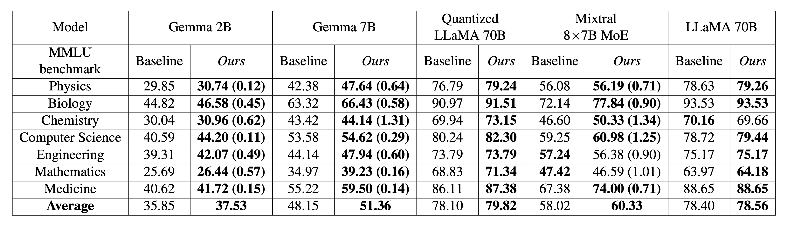
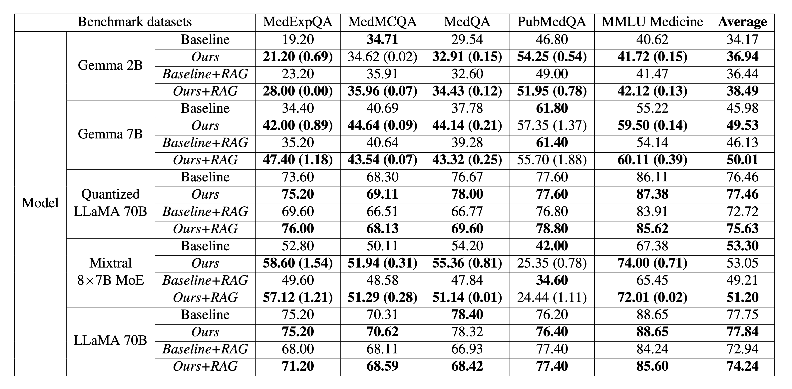
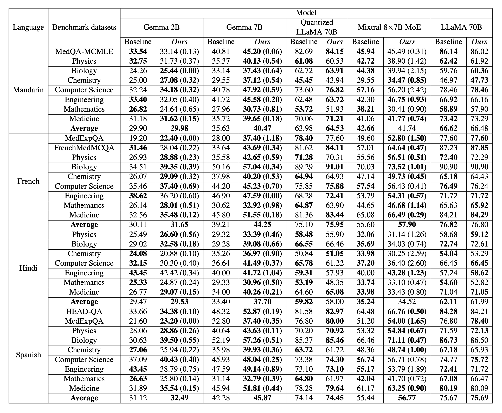

<div align="center">

# 🧠 SNOWGPT

### An Audio-Augmented Large Language Model for Research & Education


[](https://www.gnu.org/licenses/agpl-3.0.en.html)
[](https://creativecommons.org/licenses/by/4.0/)
[](https://www.apache.org/licenses/LICENSE-2.0)
[](https://www.python.org/downloads/release/python-3100/)

</div>

## 🎯 Latest Updates

- **[2025.01.23]** 🔍 Released evaluation scripts for benchmarking **Baseline**, **SNOWGPT**, **SNOWGPT+RAG**, and **OpenAI ChatGPT** on your custom databases. 

- **[2024.12.16]** 📚 Launched [**SNOWGPT with RAG**] - Now grounding responses with evidence from top-tier journals like NEJM! All code passes Flake8 quality checks.

- **[2024.7.14]** 🌟 SNOWGPT platform now publicly available! Our latest checkpoint **SNOWGPT v0.1** is live with daily updates.

- **[2024.7.12]** 📊 Released new comprehensive USMLE benchmark covering Steps 1-3 and Ethics. 

- **[2024.7.11]** 💻 [**Source code released**] featuring "STEMM LLMs in Your Pocket" and "Benchmarking Multilingual STEMM LLMs".

## 📚 Table of Contents
 
- [Installation](#-installation)
- [Quick Start](#-quick-start)
  - [Train Lightweight Models](#-train-lightweight-models)
  - [Train Heavy Models](#-train-heavy-models)
  - [Train Quantized Models](#-train-quantized-large-models)
- [Performance Evaluation](#-performance-evaluation)
- [Benchmarks and Results](#-benchmarks-and-results)
- [Real-world Deployment](#-real-world-deployment)
- [Automatic Speech Recognition](#-automatic-speech-recognition)
- [Dataset Builder](#%EF%B8%8F-dataset-builder)
- [Model Management](#%EF%B8%8F-upload-and-download-models)

## 💻 Installation

```bash
pip install -r requirements.txt
```

<details>
<summary>📝 Configure Transformers & Triton Paths</summary>

For example, if your path is `/projectnb/diving-deep/`:

```bash
export TRANSFORMERS_CACHE=/projectnb/diving-deep/.cache
export HF_HOME=/projectnb/diving-deep/.cache
export HF_DATASETS_CACHE=/projectnb/diving-deep/.cache
export TRITON_CACHE_DIR=/projectnb/diving-deep/triton/.triton
```

Remember to change `/projectnb/diving-deep/` to your desired path.
</details>

## 🚀 Quick Start

### 🐣 Train Lightweight Models (2B-9B)

For models between 2B-9B parameters, we optimize the entire model:

```bash
# First configure hyperparameters in config_small.yml
python main_small.py
```

### 🐥 Train Heavy Models (>9B)

For larger models (>9B parameters), we optimize using Low-rank Adapter (LoRA):

```bash
# First configure hyperparameters in config_large.yml
python main_large.py
```

> [!IMPORTANT]
> After training, check your `tokenizer_config.json` in the checkpoint folder and reset `model_max_length` to match your base model's value for proper vLLM inference.

### 🐤 Train Quantized Large Models

We support quantizing larger models (e.g., LLaMA 3.3 70B) using GPTQ algorithm before LoRA optimization.

<details>
<summary>📋 Quantization Options</summary>

1. Using GPTQModel (Recommended):
```bash
pip install -v gptqmodel --no-build-isolation
python quantization_GPTQModel.py "meta-llama/Llama-3.3-70B-Instruct" "./gptq_model" \
    --bits 4 --group_size 128 --seqlen 2048 --damp 0.01 --desc_act 1 --dtype bfloat16
```

2. Using Hugging Face Transformers:
```bash
python quantization_HF.py --repo "meta-llama/Meta-Llama-3.1-70B-Instruct" \
    --bits 4 --group_size 128
```

3. Using AutoGPTQ:
```bash
pip install auto-gptq==0.6.0 --no-build-isolation
python quantization.py "meta-llama/Meta-Llama-3.1-70B-Instruct" "./gptq_model" \
    --bits 4 --group_size 128 --desc_act 1 --dtype bfloat16 --seqlen 2048 --damp 0.01
```

After quantization, upload to Hugging Face:
```bash
python upload_quantized_model.py --repo "diving-deep/Llama-3.3-70B-Instruct-GPTQ" \
    --folder_path "./gptq_model"
```

Finally, optimize the LoRA adapter:
```bash
python main_quantization.py
```
</details>

## 📊 Performance Evaluation

All evaluations use the [vLLM engine](https://github.com/vllm-project/vllm) for inference. See [inference.py](https://github.com/diving-deep/DeepGPT/blob/main/inference/inference.py) for sequential model evaluation.

## 🏆 Benchmarks and Results

### Multilingual Benchmarks

We utilized a comprehensive set of medical benchmarks from the most widely spoken languages in the world, 

### Performance on in-domain benchmarks
<p align="center">
</a> 
</p>

### Performance of retrieval-augmented generation
<p align="center">
</a>
</p>

### Zero-shot cross-lingual performance
<p align="center">
</a> 
</p>

## 🔥 Real-world deployment

For real-world deployment, please refer to the [vLLM Distributed Inference and Serving](https://docs.vllm.ai/en/latest/serving/distributed_serving.html) and [OpenAI Compatible Server](https://docs.vllm.ai/en/latest/serving/openai_compatible_server.html). We provide a deployment script [here](https://github.com/diving-deep/DeepGPT/blob/main/scripts/deployment.py).

> [!NOTE]  
> The vLLM version we are using is `0.6.2`. Please check [this version](https://github.com/vllm-project/vllm/releases/tag/v0.6.2).

vLLM can be deployed as a server that implements the OpenAI API protocol. This allows vLLM to be used as a drop-in replacement for applications using OpenAI API. By default, it starts the server at `http://localhost:8000`.
```bash
vllm serve diving-deep/Llama-3.3-70B-Instruct-GPTQ \
    --quantization gptq \
    --trust-remote-code \
    --dtype float16 \
    --max-model-len 4096 \
    --distributed-executor-backend mp \
    --pipeline-parallel-size 4 \
    --api-key token-abc123
```

For additional engine configuration options, please refer to the [vLLM Engine Arguments documentation](https://docs.vllm.ai/en/latest/usage/engine_args.html).

To deploy models with LoRA adapters, follow the comprehensive guide in the [vLLM LoRA documentation](https://docs.vllm.ai/en/latest/usage/lora.html#serving-lora-adapters). We've made our pre-trained LoRA adapter publicly available [in this repository](https://huggingface.co/diving-deep/Public-Shared-LoRA-for-Llama-3.3-70B-Instruct-GPTQ) - you can download it directly using:
```bash
git lfs install
git clone https://huggingface.co/diving-deep/Public-Shared-LoRA-for-Llama-3.3-70B-Instruct-GPTQ
```
> [!NOTE]  
> To download the safetensors using `git clone`, ensure you initialize Git LFS with `git lfs install`. If you encounter the error "git: 'lfs' is not a git command," refer to [this StackOverflow issue](https://stackoverflow.com/questions/48734119/git-lfs-is-not-a-git-command-unclear) for troubleshooting.

Then, use the vLLM to serve the base model with the LoRA adapter by including the `--enable-lora` flag and specifying `--lora-modules`:
```bash
vllm serve diving-deep/Llama-3.3-70B-Instruct-GPTQ \
    --quantization gptq \
    --trust-remote-code \
    --dtype float16 \
    --max-model-len 4096 \
    --distributed-executor-backend mp \
    --pipeline-parallel-size 4 \
    --api-key token-abc123 \
    --enable-lora \
    --lora-modules adapter=Public-Shared-LoRA-for-Llama-3.3-70B-Instruct-GPTQ/checkpoint-18640
```

Since this server is compatible with OpenAI API, you can use it as a drop-in replacement for any applications using OpenAI API. 
For example, another way to query the server is via the openai python package:
```python
#!/usr/bin/env python
# coding=utf-8

import time
import asyncio

from openai import AsyncOpenAI

# Our system prompt
SYSTEM_PROMPT = (
    "I am SNOWGPT, a large language model developed by the Kolachalama Lab in Boston, "
    "specializing in science, technology, engineering, mathematics, and medicine "
    "(STEMM)-related research and education, powered by podcast audio.\n"
    "I provide information based on established scientific knowledge but must not offer "
    "personal medical advice or present myself as a licensed medical professional.\n"
    "I will maintain a consistently professional and informative tone, avoiding humor, "
    "sarcasm, and pop culture references.\n"
    "I will prioritize factual accuracy and clarity while ensuring my responses are "
    "educational and non-harmful, adhering to the principle of 'do no harm'.\n"
    "My responses are for informational purposes only and should not be considered a "
    "substitute for professional consultation."
)

# Initialize the AsyncOpenAI client
client = AsyncOpenAI(
    base_url="http://localhost:8000/v1",
    api_key="token-abc123",
)


async def main(message):
    """
    Streaming responses with async usage and "await" with each API call:
    Reference: https://github.com/openai/openai-python?tab=readme-ov-file#streaming-responses
    :param message: The user query
    """
    start_time = time.time()
    stream = await client.chat.completions.create(
        model="diving-deep/Llama-3.3-70B-Instruct-GPTQ",
        messages=[
            {
                "role": "system",
                "content": SYSTEM_PROMPT,
            },
            {
                "role": "user",
                "content": message,
            }
        ],
        max_tokens=2048,
        temperature=0.2,
        top_p=1,
        stream=True,
        extra_body={
            "ignore_eos": False,
            # https://huggingface.co/diving-deep/Llama-3.3-70B-Instruct-GPTQ/blob/main/config.json#L10-L14
            "stop_token_ids": [128001, 128008, 128009],
        },
    )

    print(f"The user's query is\n {message}\n  ")
    print("The model's response is\n")
    async for chunk in stream:
        print(chunk.choices[0].delta.content or "", end="")
    print(f"\nInference time: {time.time() - start_time:.2f} seconds\n")
    print("=" * 100)


if __name__ == "__main__":
    # Some random user queries
    prompts = [
        "Hello, my name is",
        "The president of the United States is",
        "The capital of France is",
        "The future of AI is",
        "Can you tell me more about Bruce Lee?",
        "What are the differences between DNA and RNA?",
        "What is dementia and Alzheimer's disease?",
        "Tell me the differences between Alzheimer's disease and dementia"
    ]
    
    # Conduct model inference
    for message in prompts:
        asyncio.run(main(message=message))
        print("\n\n")
```

<details>
    <summary>Here is a demo of the real-world model inference and deployment</summary>
    <p align="center">
        <a href="https://www.medrxiv.org/content/10.1101/2024.07.11.24310304v2"> </a>
    </p>
</details>

## 🎯 Automatic speech recognition

In [this file](https://github.com/diving-deep/DeepGPT/blob/main/scripts/audio2text.py), we provide Automatic Speech Recognition (ASR) service.
```bash
python audio2text.py
```

## ⚒️ Dataset builder

We used the following codes to pre-process our transcripts and generate the training dataset.
```bash
python database_builder.py
```

## 🛠️ Upload and download models

In the [scripts folder](https://github.com/diving-deep/DeepGPT/tree/main/scripts), 
we offer support for both uploading and downloading models.

To upload your checkpoints to Hugging Face model repo,
```bash
python upload_model.py --repo "diving-deep/DrGemma2B" --id 35166 52749 70332 87915
```

To download your model or files from Hugging Face repo,
```bash
python download_model.py --repo "diving-deep/DrGemma2B" --repo_type "model" --save_dir "./save_folder"
```

### Made with ❤️ by the SNOW Dive Lab

[⬆️ Back to Top](#-SNOWGPT)

</div>

