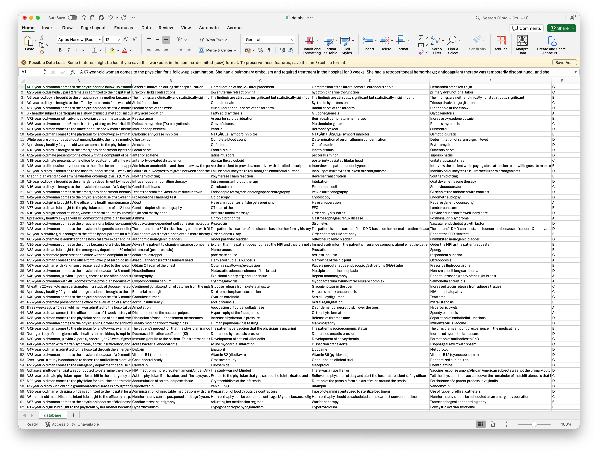

<div align="center">

# 🎯 SNOWGPT Database Evaluation

### Benchmark Your Custom Datasets Against SNOWGPT, SNOWGPT+RAG, and ChatGPT

</div>

## 📋 Overview

This toolkit enables evaluation of SNOWGPT models (with and without RAG) and ChatGPT on your custom databases, providing comprehensive performance analysis and comparison metrics.

## 🛠️ Installation

### Prerequisites
In addition to the [core SNOWGPT dependencies], install these packages:

```bash
pip install pgvector flask-sqlalchemy psycopg2
```

## 📊 Database Preparation

We use the MMLU Professional Medicine database as a reference example:

<p align="center">
  
</p>

### Required Format
Your database should include:
1. `question`: First column (A)
2. `options`: Columns B-E (options A through D)
3. `answer`: Column F (ground truth)

### Customization Guide

To modify the database structure:

1. **Adjust Option Format**:
   - Update `database_format` in [`benchmark_utils.py`](utils/benchmark_utils.py)
   - Modify answer extraction in [`eval_utils.py`](utils/eval_utils.py)
   - Adjust `option_range` in [`vllm_utils.py`](utils/vllm_utils.py)

> **Note**: The system uses regex to extract model answers. For example, it will extract "B" from a detailed response about cholesterol embolization.

## 🚀 Running Evaluations

### Basic Usage
```bash
python main.py --mode deepgpt --rag True --eval_pretrain False
```

### Parameters
- **Model Selection** (`--mode`):
  - `deepgpt`: Use DeepGPT models
  - `chatgpt`: Use OpenAI's ChatGPT
  
- **RAG Integration** (`--rag`):
  - `True`: Enable retrieval-augmented generation
  - `False`: Use base model only
  
- **Base Model Evaluation** (`--eval_pretrain`):
  - `True`: Include pre-trained model evaluation
  - `False`: Skip base model evaluation

<div align="center">

---
[⬆️ Back to Top](#-snowgpt-database-evaluation)

</div> 
